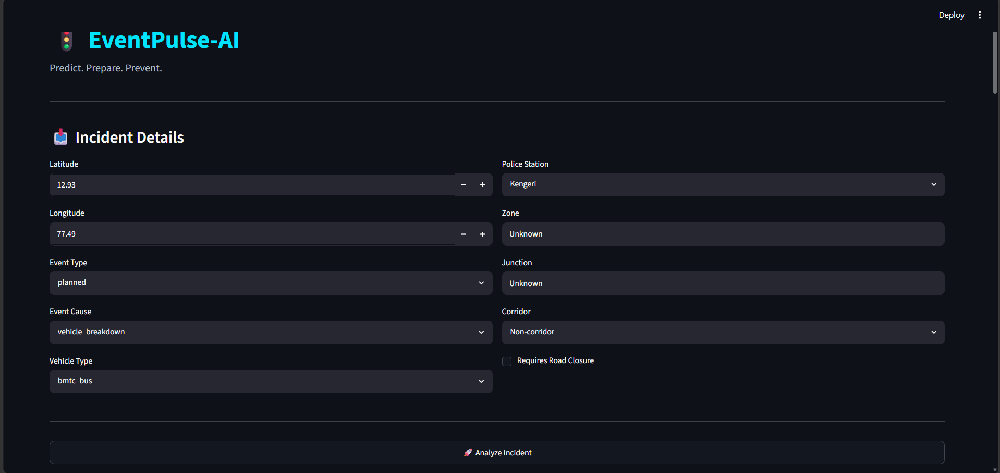
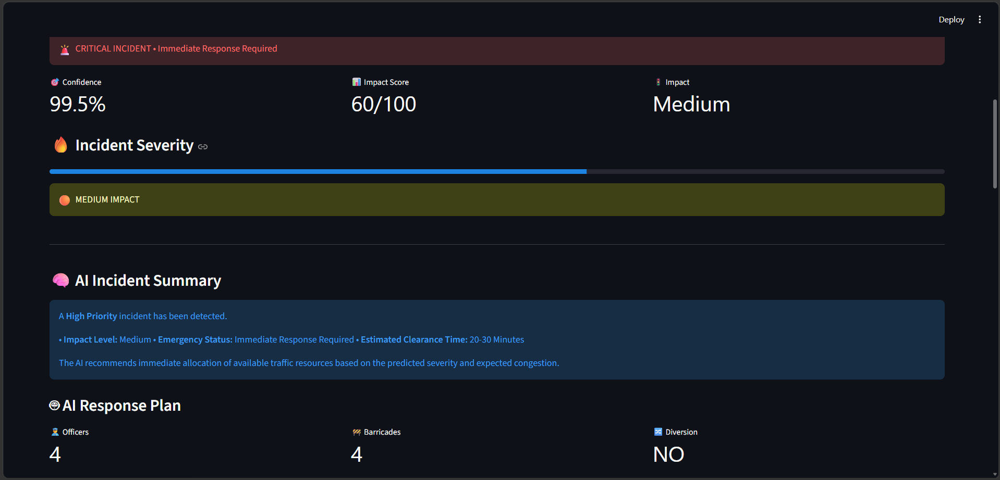
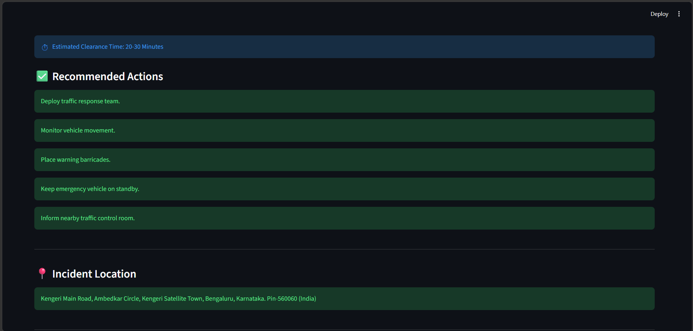
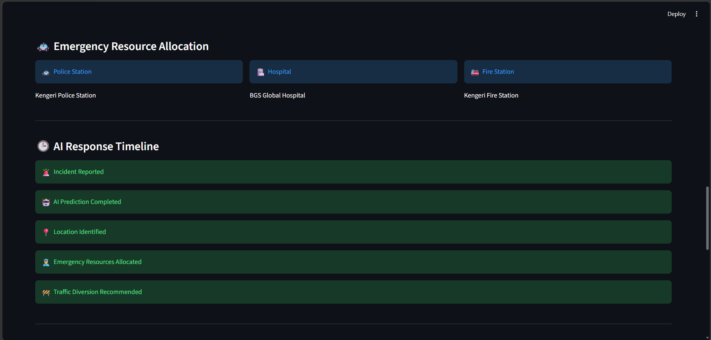
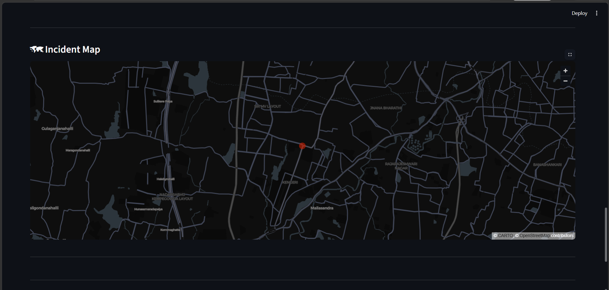

# 🚦 EventPulse-AI

> **Predict. Prepare. Prevent.**

An AI-powered Traffic Incident Management System that predicts the priority of traffic events, recommends emergency response strategies, allocates nearby resources, and visualizes incidents on an interactive dashboard.

---

## 🏆 Hackathon Submission

**Team Name:** Kaizer

### 👥 Team Members

- **Neekhil Kumar Singh**
- **Harshit Agarwal (Team Lead)**

---

# 📖 Overview

Traffic incidents often lead to delayed emergency response, increased congestion, and inefficient resource utilization.

**EventPulse-AI** leverages Machine Learning and intelligent decision support to help traffic authorities:

- Predict incident priority
- Assess operational impact
- Recommend response actions
- Allocate emergency resources
- Identify incident locations using reverse geocoding
- Visualize incidents through an interactive dashboard

Instead of relying solely on manual assessment, EventPulse-AI provides **AI-assisted operational decision support** for faster and more informed responses.

---

# ✨ Features

## 🤖 Machine Learning Priority Prediction

- Random Forest Classifier
- Predicts High / Low Priority incidents
- Confidence score for every prediction

---

## 🧠 AI Response Recommendation

Generates intelligent response plans including:

- Impact Score
- Impact Level
- Emergency Status
- Officers Required
- Barricades Required
- Diversion Recommendation
- Estimated Clearance Time
- Recommended Operational Actions

---

## 🗺 Reverse Geocoding

Integrated with **Mappls APIs**

Automatically converts incident coordinates into readable addresses.

Example:

```
Kengeri Main Road,
Ambedkar Circle,
Bengaluru,
Karnataka
```

---

## 🚓 Emergency Resource Allocation

Suggests nearby emergency resources including:

- Police Station
- Hospital
- Fire Station

---

## 📊 Interactive Dashboard

Built using **Streamlit**

Features include:

- Incident Analysis
- Severity Meter
- AI Summary
- Resource Allocation
- Incident Timeline
- Interactive Map

---

# 🏗 System Architecture

```
                  User

                    │

                    ▼

          Streamlit Dashboard

                    │

                    ▼

             FastAPI Backend

                    │

      ┌─────────────┼─────────────┐

      ▼             ▼             ▼

Random Forest   Recommendation   Mappls API
   Model            Engine

      │             │             │

      └─────────────┼─────────────┘

                    ▼

        Emergency Resource Engine

                    │

                    ▼

          AI Decision Dashboard
```

---

# 🧠 Machine Learning Pipeline

## Data Processing

- Data Cleaning
- Missing Value Treatment
- Feature Engineering
- One-Hot Encoding
- Feature Alignment

---

## Model

**Random Forest Classifier**

Reasons for selection:

- Robust
- Handles mixed features
- Less overfitting
- High interpretability
- Excellent classification performance

---

## Recommendation Engine

Rule-based operational recommendation engine built on top of ML predictions.

Generates actionable response plans rather than only predictions.

---

# 🛠 Tech Stack

### Backend

- FastAPI
- Pydantic
- Joblib

### Machine Learning

- Scikit-learn
- Pandas
- NumPy

### Frontend

- Streamlit

### APIs

- Mappls Reverse Geocoding API

### Visualization

- Streamlit
- Pandas

---

# 📂 Project Structure

```
EventPulse-AI

├── app
│   ├── __pycache__
│   ├── emergency.py
│   ├── geocode.py
│   ├── main.py
│   ├── mappls.py
│   ├── predictor.py
│   ├── recommender.py
│   ├── schemas.py
│   └── utils.py
│
├── data
│   ├── Astram event data_anonymized.csv
│   ├── cleaned_traffic_events.csv
│   └── feature_engineered_events.csv
│
├── docs
│   ├── api_design.md
│   ├── architecture.md
│   └── mvp_features.md
│
├── frontend
│   └── app.py
│
├── models
│   ├── feature_columns.pkl
│   └── random_forest.pkl
│
├── notebook
│   ├── 01_EDA_Data_Cleaning.ipynb
│   ├── 02_Feature_Engineering.ipynb
│   ├── 03_Model_Development.ipynb
│   ├── 04_Model_Comparison.ipynb
│   └── 05_Recommendation_Engine.ipynb
│
├── screenshots
│
├── venv
│
├── .env
├── .gitignore
├── requirements.txt
├── test_mappls.py
└── README.md
```

---

# 🚀 Installation

Clone the repository

```bash
git clone https://github.com/neekhilsingh/EventPulse-AI.git
```

Move into the project

```bash
cd EventPulse-AI
```

Create virtual environment

```bash
python -m venv venv
```

Activate environment

Windows

```bash
venv\Scripts\activate
```

Install dependencies

```bash
pip install -r requirements.txt
```

---

# ▶ Run Backend

```bash
uvicorn app.main:app --reload
```

Backend

```
http://127.0.0.1:8000
```

Swagger Documentation

```
http://127.0.0.1:8000/docs
```

---

# ▶ Run Frontend

```bash
streamlit run frontend/app.py
```

---
# 📸 Screenshots

## 🏠 Dashboard


---

## 🔮 Prediction Result


---

## 🧠 AI Recommendation


---

## 🚓 Emergency Resource Allocation


---

# 🗺️ Interactive Map


---

# 🎯 Impact

EventPulse-AI enables authorities to:

- Improve emergency response time
- Reduce traffic congestion
- Optimize resource allocation
- Assist operational decision-making
- Enhance urban traffic management

---

# 🔮 Future Improvements
- Live Traffic API Integration
- Real-time CCTV Analytics
- GPS-based Incident Detection
- Deep Learning Models
- Automatic Route Optimization
- Live Emergency Vehicle Tracking
- SMS & Push Notifications
- Cloud Deployment
- Mobile Application

---


# 👨‍💻 Team Kaizer

**Harshit Agarwal** — Team Lead

**Neekhil Kumar Singh**

---

# 📜 License

This project was developed as part of a hackathon submission and is intended for educational and research purposes.

---

# ⭐ EventPulse-AI

### **Predict. Prepare. Prevent.**
